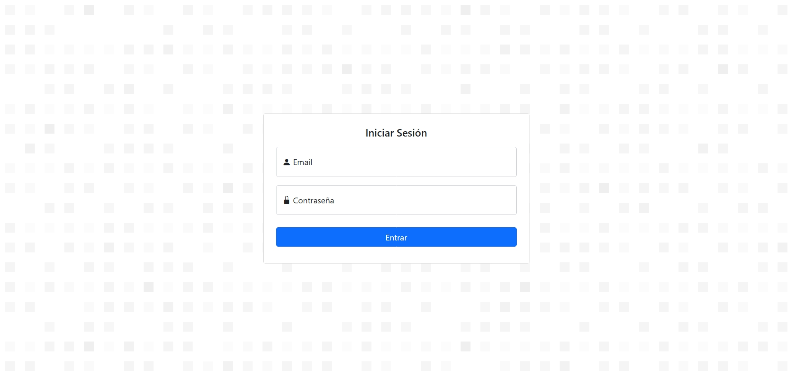
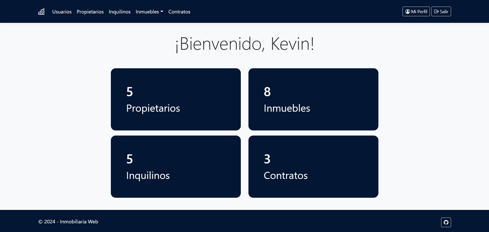
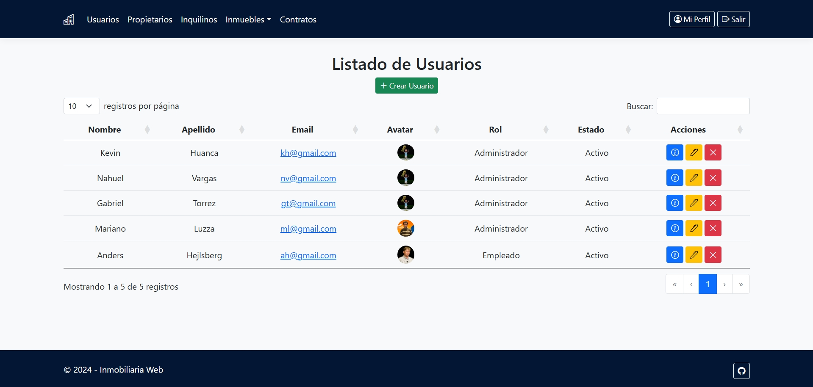
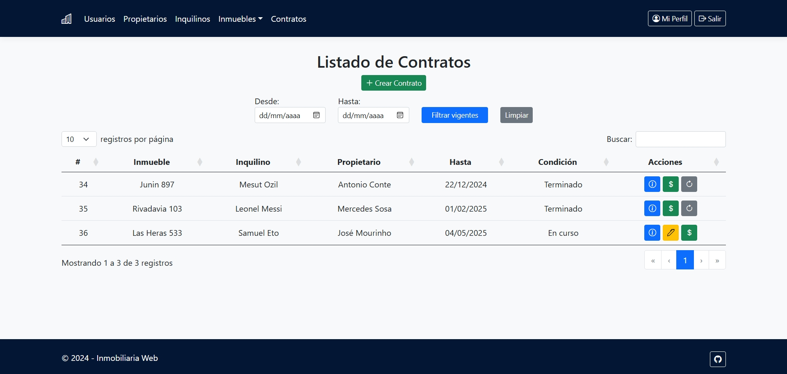
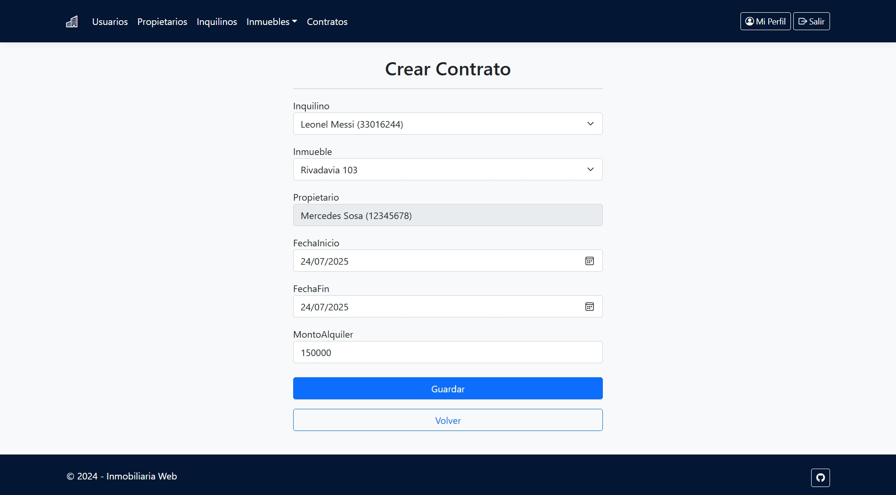
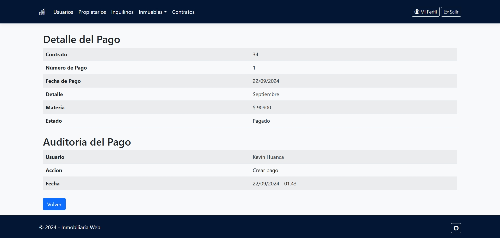
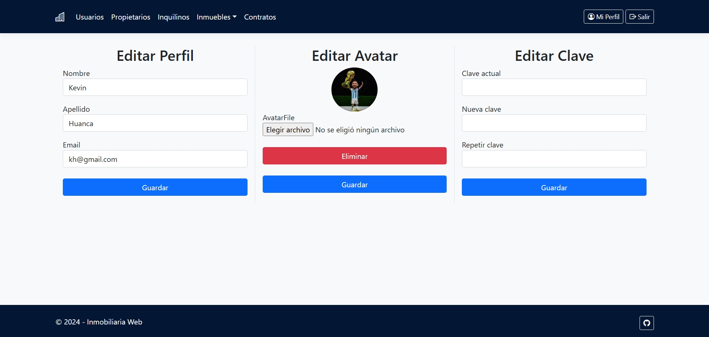

# Inmobiliaria Web
El sistema trata de la informatización de la gestión de alquileres de propiedades inmuebles que realiza una agencia inmobiliaria.

## Tecnologías utilizadas
* **Backend:** ASP.NET Core
* **Frontend:** Razor Pages, Bootstrap
* **Base de datos:** MySQL (con ADO.NET para la conexión)
* **Autenticación:** Identity de ASP.NET Core (basado en cookies)

## Características
* ABMC de Propietarios, Inquilinos, Inmuebles, Contratos, Pagos y Usuarios (roles diferenciados: Administrador/Empleado).
* Edición de perfil de usuario: cambiar contraseña, foto de perfil.
* Autenticación y autorización con roles (solo Administradores gestionan usuarios).
* Gestión de inmuebles disponibles, contratos vigentes y pagos asociados.
* Validación de fechas y control de superposiciones en contratos.
* Permite renovar o terminar contratos con multas.
* Registro de auditoría (quién crea, edita o anula contratos y pagos, solo visible para administradores).
* Interfaz amigable con validaciones y navegación intuitiva.

## Credenciales de prueba:
Administración:
- Usuario: `ml@gmail.com`
- Contraseña: `123`

Empleado:
- Usuario: `ah@gmail.com`
- Contraseña: `123`

## Vista previa

###

###

###

###

###

###

